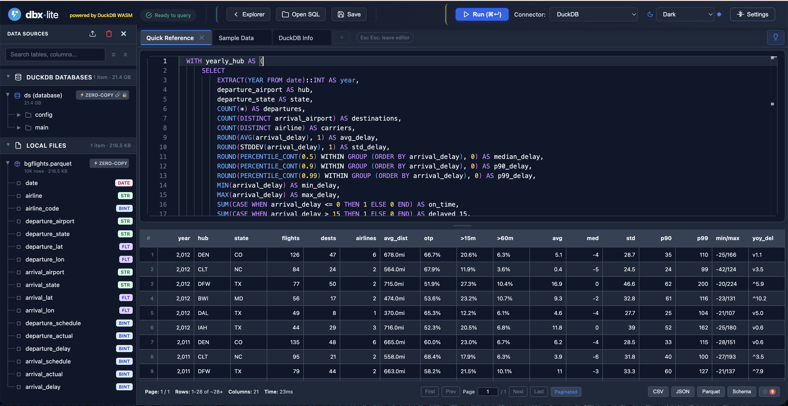
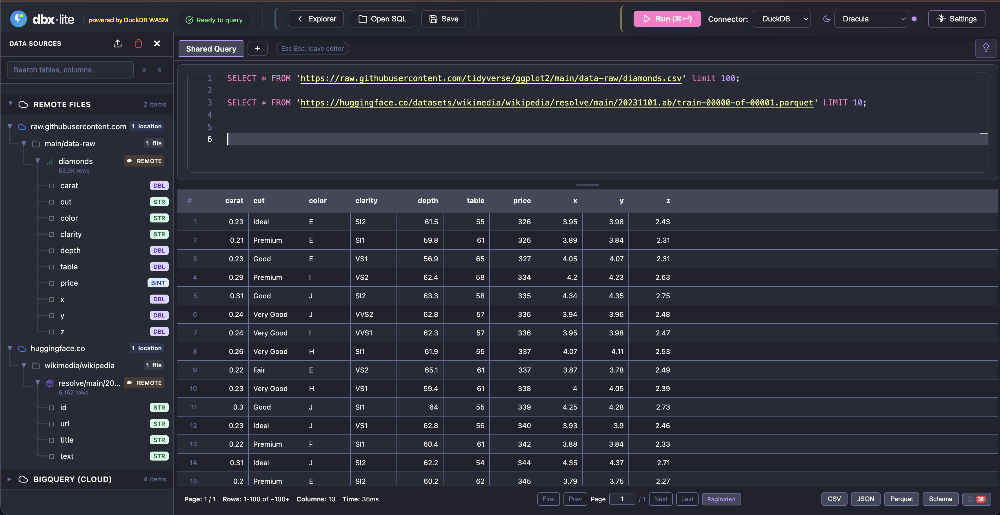
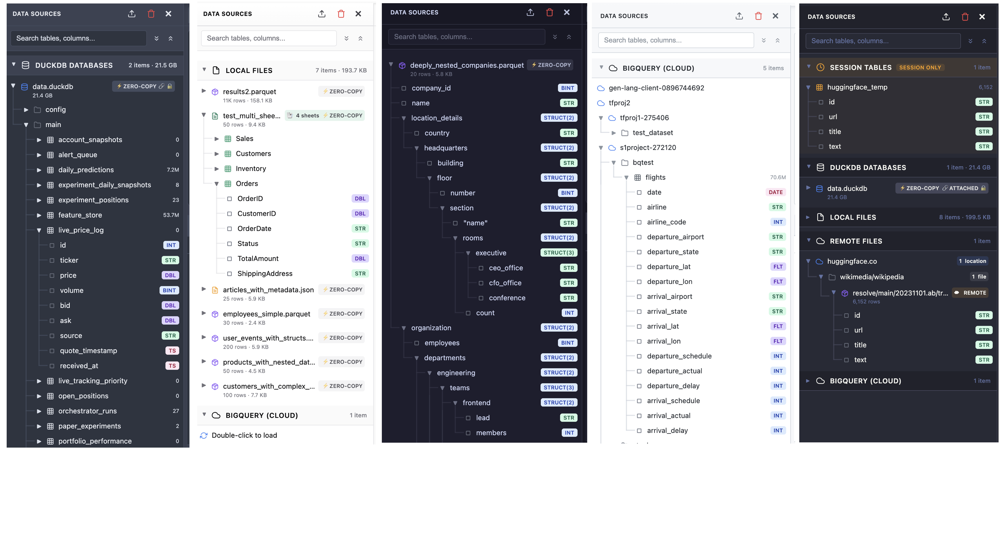
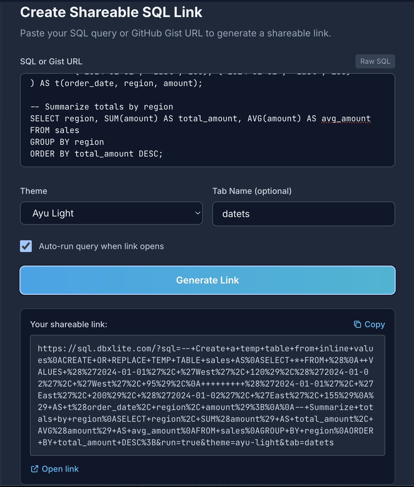
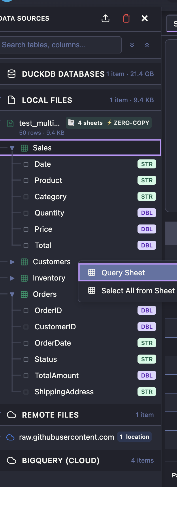

# dbxlite

[](https://github.com/hfmsio/dbxlite/actions)
[](LICENSE)
[](package.json)
[](package.json)
[](package.json)

Run SQL locally in your browser—no servers, no installs. dbxlite is a React/Vite client powered by DuckDB WebAssembly, so your data never leaves your machine.

## Highlights
- Zero-setup: open the app and query immediately; works offline once the DuckDB WASM bundle is downloaded.
- Private by design: queries execute fully in-browser; files stay on your disk.
- Multi-source: local files (CSV/TSV/JSON/Parquet/Excel/JSONL), remote URLs, and attached DuckDB databases. BigQuery connector included; Snowflake coming soon.
- Fast UI: Monaco editor with autocomplete, multi-tabs, formatter; results grid tuned for large datasets with copy/export and keyboard navigation.
- Persistent handles: re-open local files and DuckDB databases between sessions; in-memory tables are session-scoped.

## Quick Start
**Live Demo:** https://sql.dbxlite.com

```bash
git clone https://github.com/hfmsio/dbxlite.git
cd dbxlite
pnpm install  # Automatically downloads DuckDB WASM files (~107 MB)
pnpm dev
```
Open the URL Vite prints (defaults to http://localhost:5173).

Requirements: Node.js 18+, pnpm 8+.

## Screenshots

**Main Interface**


**Query Remote Files (CSV, Parquet via HTTP)**


**Schema Explorer with Multi-Theme Support**


**URL Sharing**


**Excel File Support**


**Export to Parquet/CSV/JSON**


## Core Commands
- `pnpm dev` — start the web client locally
- `pnpm build` — build all workspaces
- `pnpm lint` / `pnpm lint:fix` — Biome lint (errors only) and auto-fix
- `pnpm test` — Vitest suite
- `pnpm e2e` / `pnpm e2e:headed` / `pnpm e2e:ui` — Playwright end-to-end runs

## Project Structure
```
dbxlite/
├─ apps/
│  └─ web-client/           # React/Vite frontend
│     ├─ src/
│     │  ├─ components/     # UI components (EditorPane, TabBar, Header, etc.)
│     │  ├─ containers/     # Composite components (DialogsContainer, MainContent)
│     │  ├─ contexts/       # React contexts (TabContext, QueryContext)
│     │  ├─ hooks/          # Custom hooks (useQueryExecution, useTabManager, etc.)
│     │  ├─ services/       # Data services (data-source-store, settings-store)
│     │  ├─ stores/         # Zustand stores (settingsStore)
│     │  └─ utils/          # Utilities (formatters, dataTypes, logger)
│     └─ App.tsx            # Main orchestrator (~680 lines)
├─ packages/
│  ├─ connectors/           # Data connectors (DuckDB, BigQuery)
│  ├─ duckdb-wasm-adapter/  # Worker/engine bridge
│  ├─ storage/              # Credential and handle storage
│  ├─ schema-cache/         # Metadata caching
│  └─ plugins/              # Extensible plugin surface
├─ docs/                    # Architecture and usage docs
└─ scripts/                 # Tooling (e.g., download DuckDB WASM)
```

### Frontend Architecture
The web-client uses a layered architecture:
- **Providers**: ToastProvider → SettingsProvider → DataSourceProvider → TabProvider → QueryProvider
- **Contexts**: TabContext (tab state + refs), QueryContext (connector state)
- **Hooks**: 15+ custom hooks handling query execution, file operations, auto-save, keyboard shortcuts
- **Containers**: DialogsContainer groups modals; MainContent handles editor/results layout

See [docs/ARCHITECTURE.md](docs/ARCHITECTURE.md) for detailed diagrams.

## Data & Workflow Notes
- Local files use the File System Access API; prefer zero-copy paths for speed. Remote URLs are fetched on demand. DuckDB `.db` files can be attached and reused.
- Query execution runs in a Web Worker; large results stream via Arrow for responsive grids.
- Keyboard shortcuts: `Cmd/Ctrl+Enter` to run, `Cmd/Ctrl+Shift+F` to format, `Cmd/Ctrl+Home/End` to jump pages in the grid.

## URL Sharing

Share queries via URL parameters or GitHub Gists:

```bash
# Load built-in example
http://localhost:5173/?example=wikipedia&run=true

# Direct SQL (URL-encoded)
http://localhost:5173/?sql=SELECT%20*%20FROM%20range(10)&run=true

# GitHub Gist
http://localhost:5173/?share=gist:abc123&run=true

# With theme
http://localhost:5173/?example=covid&run=true&theme=dracula
```

**Parameters:** `example`, `sql`, `share`, `run`, `tab`, `theme`, `explorer`

**Themes:** `vs-dark`, `dracula`, `nord`, `tokyo-night`, `catppuccin`, `vs-light`, `github-light`, `solarized-light`, `ayu-light`, `one-dark`

See [docs/URL-SHARING.md](docs/URL-SHARING.md) for full reference.

## Known Limitations & Roadmap

### Current Limitations

**Credential Storage** (`credential-store.ts`)
- Credentials are stored in browser localStorage without encryption
- For sensitive production use, implement encrypted storage (planned for v0.3)

**Parquet Support** (`materialization-manager.ts`, `import-queue.ts`)
- Parquet export uses JSON serialization as intermediate format
- Native Parquet library integration (parquetjs or Arrow) planned for improved performance

**Connection Testing** (`connection-store.tsx`)
- Connection validation is simulated
- Actual connection testing based on connector type in development

**Connector Integration** (`import-queue.ts`)
- Table import connector integration is a work-in-progress
- Snowflake and other cloud data warehouse connectors in active development

### Planned Improvements

- ✓ BigQuery connector (REST API + OAuth)
- ⬜ Snowflake connector (SQL REST API + OAuth)
- ⬜ Supabase connector (PostgREST - browser-friendly PostgreSQL)
- ⬜ Encrypted credential storage
- ⬜ Native Parquet export via parquetjs
- ⬜ Query result caching layer

> **Note:** Browser-based apps can only connect to databases via HTTP/REST APIs. Traditional databases (PostgreSQL, MySQL) use TCP protocols that browsers cannot access directly. See [CONTRIBUTING.md](CONTRIBUTING.md#adding-new-connectors) for details.

## Contributing & Community
- See [CONTRIBUTING](CONTRIBUTING.md) for setup, workflow, and testing guidance.
- Please follow the [Code of Conduct](CODE_OF_CONDUCT.md).
- Security issues: report privately via [SECURITY](SECURITY.md).

## License
MIT — see [LICENSE](LICENSE).
