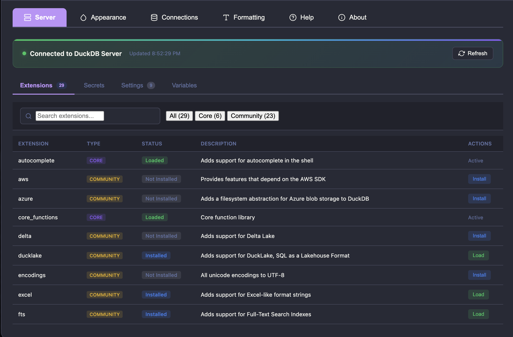

# dbxlite

[](https://github.com/hfmsio/dbxlite/actions)
[](https://www.npmjs.com/package/dbxlite-ui)
[](https://www.npmjs.com/package/dbxlite-ui)
[](LICENSE)
[](package.json)

A modern SQL workbench for DuckDB. Use it with your local DuckDB CLI for full power, or run entirely in-browser with zero install.

## Quick Start

### Server Mode (Recommended)

Use dbxlite as a drop-in replacement for `duckdb -ui`:

```bash
# Start local asset server
npx dbxlite-ui                              # Serves UI on port 8080

# In another terminal, launch DuckDB with the local UI
export ui_remote_url="http://localhost:8080"
duckdb -unsigned -ui
```

Open http://localhost:4213 in your browser. You get full native DuckDB with all extensions, unlimited memory, and direct filesystem access.

**With an existing database:**
```bash
duckdb mydata.duckdb -unsigned -ui
```

**Alternative: Use hosted assets (no npm required):**
```bash
export ui_remote_url="https://sql.dbxlite.com"
duckdb -unsigned -ui
```

> The hosted URL only serves static UI assets (similar to the default DuckDB UI hosted by MotherDuck). All data and query execution stays local: DuckDB on your machine talks directly to your browser. Nothing is sent to external servers.

> The `-unsigned` flag is required for custom UI URLs. This is a DuckDB security measure.

### WASM Mode (Zero Install)

No DuckDB CLI? Visit **https://sql.dbxlite.com** directly. Runs entirely in your browser with DuckDB WebAssembly.

### Mode Comparison

| | Server Mode | WASM Mode |
|---|-------------|-----------|
| **Memory** | Unlimited | ~2-4GB browser limit |
| **Extensions** | All (httpfs, spatial, iceberg, etc.) | Limited subset |
| **Filesystem** | Direct access | File handles only |
| **BigQuery** | Via DuckDB extension | Browser OAuth connector |
| **Install** | DuckDB CLI required | Zero install |
| **Offline** | Requires CLI | Works after first load |

---

## Highlights

**Query Any Data, Any Size**
Query CSV, Parquet, Excel, JSON, JSONL locally or from cloud URLs. In Server mode, access your entire filesystem. In WASM mode, files register via File System Access API and stay on disk.

**Full SQL Workbench**
Monaco editor with autocomplete and formatting. Schema explorer that visualizes nested structs and shows all sheets in Excel files. Results grid with cell-by-cell keyboard navigation, cell modal for large content, export to Parquet/CSV/JSON. 10 color themes.

**Cloud Data Warehouses**
Query BigQuery directly with cost estimates before you run. In Server mode, use DuckDB's native BigQuery extension. In WASM mode, use the browser OAuth connector.

**Share Executable SQL**
Share queries via URL that run on click. Built-in examples include getting started, remote datasets, DuckDB tutorials, and advanced analytics.

**Private by Default**
In WASM mode, everything runs in your browser - data never leaves your machine. In Server mode, data stays on your local machine. Cloud connectors communicate directly with their APIs.

---

## Development

```bash
git clone https://github.com/hfmsio/dbxlite.git
cd dbxlite
pnpm install
pnpm build

# Run with local DuckDB (Server mode)
cd apps/cli && node scripts/build.js && node dist/cli.js
# Then: export ui_remote_url="http://127.0.0.1:8080" && duckdb -unsigned -ui

# Run standalone (WASM mode)
pnpm dev  # Opens http://localhost:5173
```

Requirements: Node.js 18+, pnpm 8+.

## Screenshots

**Main Interface**


**Query Remote Files (CSV, Parquet via HTTP)**


**Schema Explorer with Multi-Theme Support**


**URL Sharing**


**Excel File Support**


**Export to Parquet/CSV/JSON**


**Server Settings (HTTP Mode)**


## Core Commands
- `pnpm dev` — start the web client locally
- `pnpm build` — build all workspaces
- `pnpm lint` / `pnpm lint:fix` — Biome lint (errors only) and auto-fix
- `pnpm test` — Vitest suite
- `pnpm e2e` / `pnpm e2e:headed` / `pnpm e2e:ui` — Playwright end-to-end runs

## Project Structure
```
dbxlite/
├─ apps/
│  ├─ web-client/           # React/Vite frontend
│  │  ├─ src/
│  │  │  ├─ components/     # UI components (EditorPane, TabBar, Header, etc.)
│  │  │  ├─ containers/     # Composite components (DialogsContainer, MainContent)
│  │  │  ├─ contexts/       # React contexts (TabContext, QueryContext)
│  │  │  ├─ hooks/          # Custom hooks (useQueryExecution, useTabManager, etc.)
│  │  │  ├─ services/       # Data services (data-source-store, settings-store)
│  │  │  ├─ stores/         # Zustand stores (settingsStore)
│  │  │  └─ utils/          # Utilities (formatters, dataTypes, logger)
│  │  └─ App.tsx            # Main orchestrator (~680 lines)
│  └─ cli/                  # dbxlite-ui npm package (for duckdb -ui integration)
├─ packages/
│  ├─ connectors/           # Data connectors (DuckDB, BigQuery)
│  ├─ duckdb-wasm-adapter/  # Worker/engine bridge
│  ├─ storage/              # Credential and handle storage
│  ├─ schema-cache/         # Metadata caching
│  └─ plugins/              # Extensible plugin surface
├─ docs/                    # Architecture and usage docs
└─ scripts/                 # Tooling (e.g., download DuckDB WASM)
```

### Frontend Architecture
The web-client uses a layered architecture:
- **Providers**: ToastProvider → SettingsProvider → DataSourceProvider → TabProvider → QueryProvider
- **Contexts**: TabContext (tab state + refs), QueryContext (connector state)
- **Hooks**: 15+ custom hooks handling query execution, file operations, auto-save, keyboard shortcuts
- **Containers**: DialogsContainer groups modals; MainContent handles editor/results layout

See [docs/ARCHITECTURE.md](docs/ARCHITECTURE.md) for detailed diagrams.

## Data & Workflow Notes
- Local files use the File System Access API; prefer zero-copy paths for speed. Remote URLs are fetched on demand. DuckDB `.db` files can be attached and reused.
- Query execution runs in a Web Worker; large results stream via Arrow for responsive grids.
- Keyboard shortcuts: `Cmd/Ctrl+Enter` to run, `Cmd/Ctrl+Shift+F` to format, `Cmd/Ctrl+Home/End` to jump pages in the grid.

## URL Sharing

Share queries via URL parameters or GitHub Gists:

```bash
# Load built-in example
http://localhost:5173/?example=wikipedia&run=true

# Direct SQL (URL-encoded)
http://localhost:5173/?sql=SELECT%20*%20FROM%20range(10)&run=true

# GitHub Gist
http://localhost:5173/?share=gist:abc123&run=true

# With theme
http://localhost:5173/?example=covid&run=true&theme=dracula
```

**Parameters:** `example`, `sql`, `share`, `run`, `tab`, `theme`, `explorer`

**Themes:** `vs-dark`, `dracula`, `nord`, `tokyo-night`, `catppuccin`, `vs-light`, `github-light`, `solarized-light`, `ayu-light`, `one-dark`

See [docs/URL-SHARING.md](docs/URL-SHARING.md) for full reference.

## Known Limitations & Roadmap

### Current Limitations

**Credential Storage** (`credential-store.ts`)
- Credentials are stored in browser localStorage without encryption
- For sensitive production use, implement encrypted storage (planned for v0.3)

**Parquet Support** (`materialization-manager.ts`, `import-queue.ts`)
- Parquet export uses JSON serialization as intermediate format
- Native Parquet library integration (parquetjs or Arrow) planned for improved performance

**Connection Testing** (`connection-store.tsx`)
- Connection validation is simulated
- Actual connection testing based on connector type in development

**Connector Integration** (`import-queue.ts`)
- Table import connector integration is a work-in-progress
- Snowflake and other cloud data warehouse connectors in active development

### Planned Improvements

- ✓ BigQuery connector (REST API + OAuth)
- ⬜ Snowflake connector (SQL REST API + OAuth)
- ⬜ Supabase connector (PostgREST - browser-friendly PostgreSQL)
- ⬜ Encrypted credential storage
- ⬜ Native Parquet export via parquetjs
- ⬜ Query result caching layer

> **Note:** Browser-based apps can only connect to databases via HTTP/REST APIs. Traditional databases (PostgreSQL, MySQL) use TCP protocols that browsers cannot access directly. See [CONTRIBUTING.md](CONTRIBUTING.md#adding-new-connectors) for details.

## Contributing & Community
- See [CONTRIBUTING](CONTRIBUTING.md) for setup, workflow, and testing guidance.
- Please follow the [Code of Conduct](CODE_OF_CONDUCT.md).
- Security issues: report privately via [SECURITY](SECURITY.md).

## License
MIT — see [LICENSE](LICENSE).
