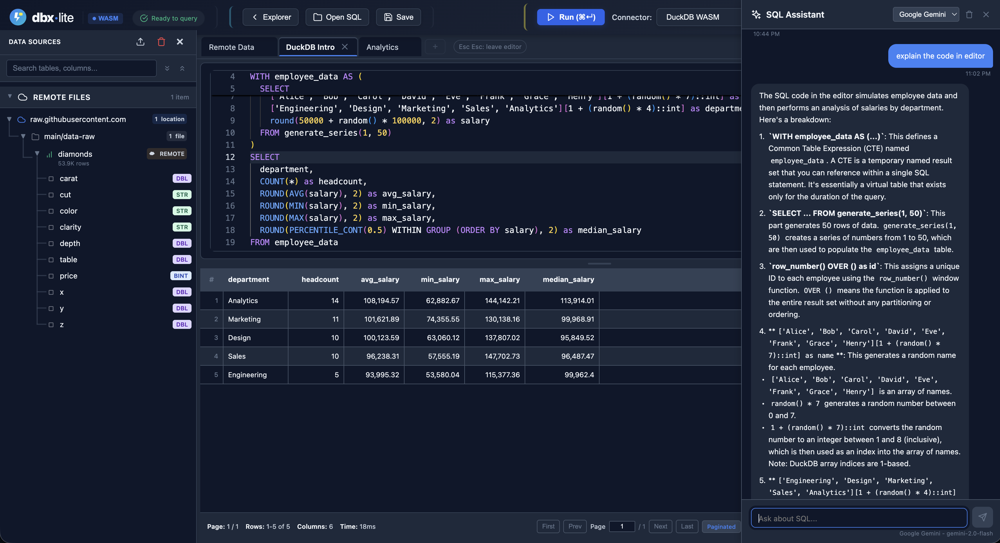
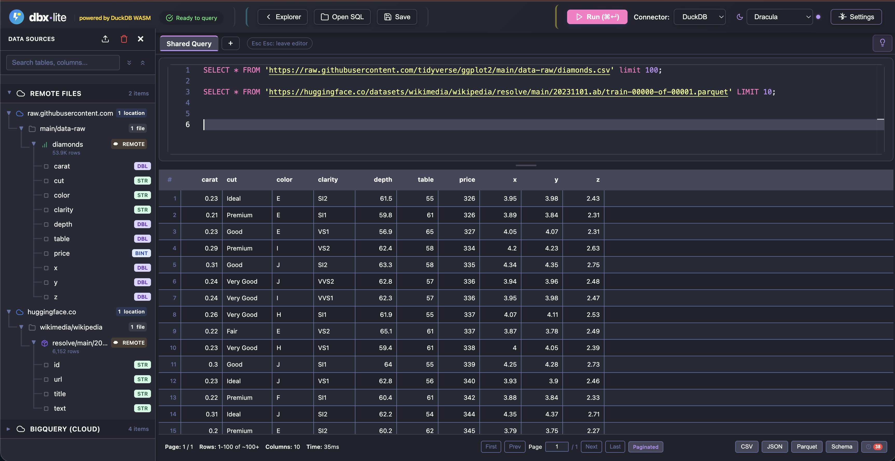
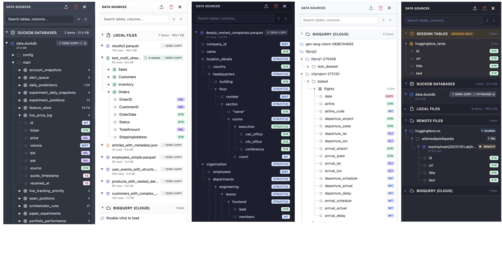
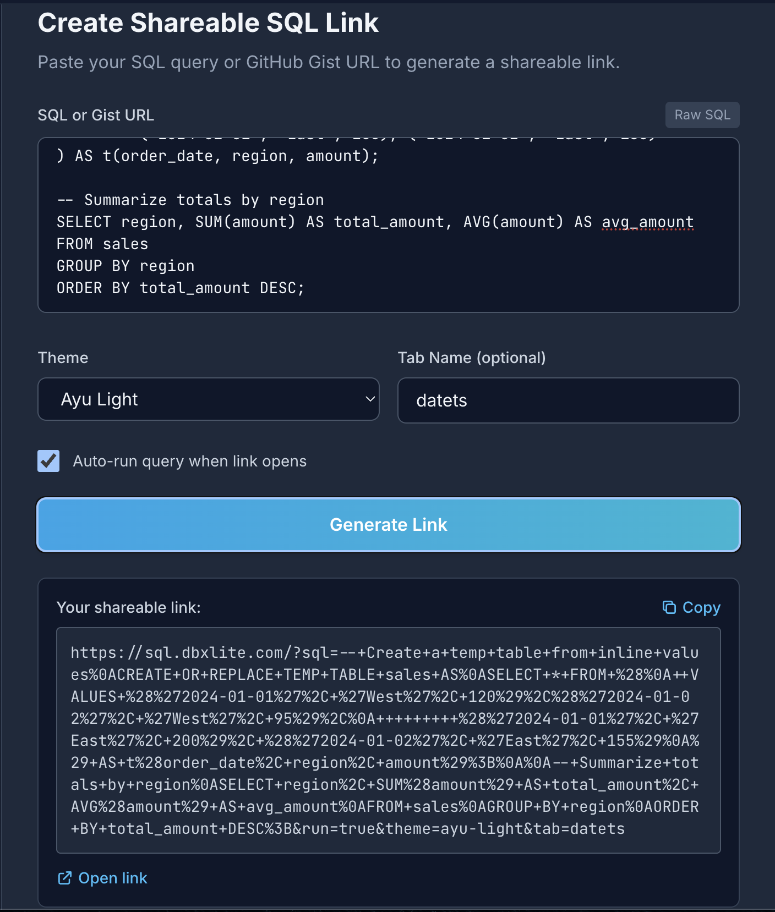
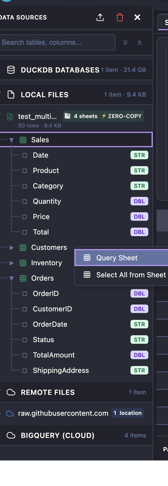
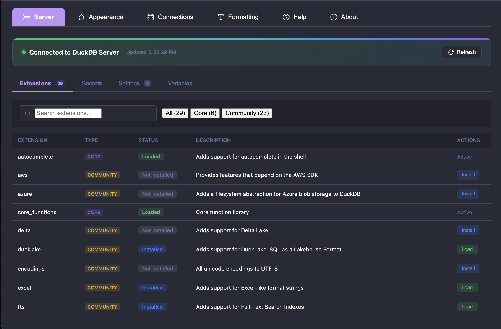

# dbxlite

[](https://github.com/hfmsio/dbxlite/actions)
[](https://www.npmjs.com/package/dbxlite-ui)
[](https://www.npmjs.com/package/dbxlite-ui)
[](LICENSE)
[](package.json)

A SQL workbench that handles real data, in your browser. OPFS-backed WASM mode opens files limited only by your disk size. The result grid streams arbitrarily large sets via virtual scrolling. One UI for DuckDB, BigQuery, and Snowflake. Server mode is a drop-in replacement for `duckdb -ui`.

**Try it now (no install):** [sql.dbxlite.com](https://sql.dbxlite.com)

## Highlights

- **Disk-sized files in WASM mode.** OPFS-backed persistence opens multi-gigabyte CSV / Parquet / JSON files in the browser without hitting the 2-4 GB RAM ceiling that kills other in-browser tools.
- **Virtual-scrolled result grid.** Streams arbitrarily large result sets without freezing the renderer.
- **One UI for three engines.** DuckDB, BigQuery, and Snowflake share the same explorer, query editor, grid, and export flow. The Snowflake explorer mirrors Snowsight (databases, schemas, tables, column preview, compute status, query history).
- **Server mode is a drop-in for `duckdb -ui`.** Run dbxlite as the UI for your local DuckDB CLI. Full extensions, unlimited memory, direct filesystem access.
- **Cross-engine Parquet export.** Pull data out of BigQuery or Snowflake into a portable Parquet file. Same export path for every engine.
- **Excel sheets as first-class.** Multi-sheet `.xlsx` files appear in the explorer with every sheet's columns and types surfaced as proper tables.
- **Cell viewer for large values.** Press `Enter` on any cell with long text or structured data to open it in an inline viewer.
- **Polished by default.** Ten color themes, light/dark modes, multi-level explorer, configurable layout, fast keyboard navigation.

## Privacy & license

- **Local files stay local.** The File System Access API gives DuckDB a handle, not an upload. The browser never copies your file off your machine.
- **Credentials encrypted at rest** in IndexedDB (AES-GCM). Threat model: protects against casual localStorage reads, not XSS or filesystem access on your machine.
- **No account, no signup, no telemetry.**
- **Open source, MIT.**

## Quick Start

### WASM Mode (zero install)

The hosted version at **[sql.dbxlite.com](https://sql.dbxlite.com)** is the same app served as static assets, with DuckDB compiled to WebAssembly. The URL serves UI only; queries run locally on your machine. Or run a copy yourself: `pnpm dev`.

### Server Mode (full DuckDB power)

Use dbxlite as a drop-in replacement for `duckdb -ui`:

```bash
# Start local asset server
npx dbxlite-ui                              # Serves UI on port 8080

# In another terminal, launch DuckDB with the local UI
export ui_remote_url="http://localhost:8080"
duckdb -unsigned -ui
```

Open http://localhost:4213 in your browser. You get full native DuckDB with all extensions, unlimited memory, and direct filesystem access.

**With an existing database:**
```bash
duckdb mydata.duckdb -unsigned -ui
```

> The `-unsigned` flag is required for custom UI URLs (DuckDB security measure).

### Mode Comparison

| | Server Mode | WASM Mode |
|---|-------------|-----------|
| **Memory** | Unlimited | ~2-4GB browser limit (OPFS extends file storage to disk size) |
| **Extensions** | All (httpfs, spatial, iceberg, etc.) | Limited subset |
| **Filesystem** | Direct access | File handles only |
| **BigQuery** | Via DuckDB extension | Browser OAuth connector |
| **Snowflake** | Via DuckDB extension | Browser OAuth connector (SQL REST API v2) |
| **Install** | DuckDB CLI required | Zero install |
| **Offline** | Requires CLI | Works after first load |

---

## How to use it

### Local files (the core)

Query CSV, Parquet, Excel, JSON, and JSONL. Local files via the File System Access API stay on disk; remote URLs are read via DuckDB's `httpfs` extension. The editor is Monaco with SQL autocomplete; results stream via Arrow IPC.

Server mode gives you full native DuckDB with every extension. WASM mode runs the same engine in a Web Worker; with OPFS persistence it can open files much larger than browser RAM.

### Warehouses (optional)

BigQuery and Snowflake connect directly from the browser. BigQuery talks to GCP because Google APIs serve CORS. Snowflake doesn't, so it routes through a thin proxy that strips response headers Snowflake adds (CSRF cookies, content-encoding) and rewrites the URL. Both OAuth 2.0 PKCE and Programmatic Access Tokens are supported. PATs are the lower-friction path for users without ACCOUNTADMIN.

### AI assistant (optional, opt-in)

Bring your own key for OpenAI, Anthropic, Gemini, or Groq, or use Snowflake Cortex if you're already on Snowflake. Keys are encrypted with AES-GCM, and a one-time consent dialog gates the first send to each external provider. Toggle with `Cmd/Ctrl+Shift+A`. **AI is off until you enable it.**

### Sharing

Queries are shareable as URLs that run on click: `?example=`, `?sql=`, `?share=gist:...`, plus `&theme=` and `&run=true`.

---

## Development

```bash
git clone https://github.com/hfmsio/dbxlite.git
cd dbxlite
pnpm install
pnpm build

# Run with local DuckDB (Server mode)
cd apps/cli && node scripts/build.js && node dist/cli.js
# Then: export ui_remote_url="http://127.0.0.1:8080" && duckdb -unsigned -ui

# Run standalone (WASM mode)
pnpm dev  # Opens http://localhost:5173
```

Requirements: Node.js 18+, pnpm 8+.

## Screenshots

**Main Interface**


**Query Remote Files (CSV, Parquet via HTTP)**


**Schema Explorer with Multi-Theme Support**


**URL Sharing**


**Excel File Support**


**Export to Parquet/CSV/JSON**


**Server Settings (HTTP Mode)**


## Core Commands
- `pnpm dev`: start the web client locally
- `pnpm build`: build all workspaces
- `pnpm lint` / `pnpm lint:fix`: Biome lint (errors only) and auto-fix
- `pnpm test`: Vitest suite
- `pnpm e2e` / `pnpm e2e:headed` / `pnpm e2e:ui`: Playwright end-to-end runs

## Project Structure
```
dbxlite/
├─ apps/
│  ├─ web-client/           # React/Vite frontend
│  │  ├─ src/
│  │  │  ├─ components/     # UI components (EditorPane, TabBar, Header, etc.)
│  │  │  ├─ containers/     # Composite components (DialogsContainer, MainContent)
│  │  │  ├─ contexts/       # React contexts (TabContext, QueryContext)
│  │  │  ├─ hooks/          # Custom hooks (useQueryExecution, useTabManager, etc.)
│  │  │  ├─ services/       # Data services (data-source-store, settings-store, ai/)
│  │  │  ├─ stores/         # Zustand stores (settingsStore, aiChatStore)
│  │  │  └─ utils/          # Utilities (formatters, dataTypes, logger)
│  │  └─ App.tsx            # Main orchestrator (~860 lines)
│  └─ cli/                  # dbxlite-ui npm package (for duckdb -ui integration)
├─ packages/
│  ├─ connectors/           # Data connectors (DuckDB, BigQuery, Snowflake)
│  ├─ duckdb-wasm-adapter/  # Worker/engine bridge
│  ├─ storage/              # Credential and handle storage
│  ├─ schema-cache/         # Metadata caching
│  └─ plugins/              # Extensible plugin surface
├─ docs/                    # Architecture and usage docs
└─ scripts/                 # Tooling (e.g., download DuckDB WASM)
```

### Frontend Architecture
The web-client uses a layered architecture:
- **Providers**: ToastProvider → SettingsProvider → DataSourceProvider → TabProvider → QueryProvider
- **Contexts**: TabContext (tab state + refs), QueryContext (connector state)
- **Hooks**: 15+ custom hooks handling query execution, file operations, auto-save, keyboard shortcuts
- **Containers**: DialogsContainer groups modals; MainContent handles editor/results layout

See [docs/ARCHITECTURE.md](docs/ARCHITECTURE.md) for detailed diagrams.

## Data & Workflow Notes
- Local files use the File System Access API; prefer zero-copy paths for speed. Remote URLs are fetched on demand. DuckDB `.db` files can be attached and reused.
- Query execution runs in a Web Worker; large results stream via Arrow for responsive grids.
- Keyboard shortcuts: `Cmd/Ctrl+Enter` to run, `Cmd/Ctrl+Shift+F` to format, `Cmd/Ctrl+Shift+A` to toggle AI assistant, `Cmd/Ctrl+Home/End` to jump pages in the grid.

## URL Sharing

Share queries via URL parameters or GitHub Gists:

```bash
# Load built-in example
http://localhost:5173/?example=wikipedia&run=true

# Direct SQL (URL-encoded)
http://localhost:5173/?sql=SELECT%20*%20FROM%20range(10)&run=true

# GitHub Gist
http://localhost:5173/?share=gist:abc123&run=true

# With theme
http://localhost:5173/?example=covid&run=true&theme=dracula
```

**Parameters:** `example`, `sql`, `share`, `run`, `tab`, `theme`, `explorer`

**Themes:** `vs-dark`, `dracula`, `nord`, `tokyo-night`, `catppuccin`, `vs-light`, `github-light`, `solarized-light`, `ayu-light`, `one-dark`

See [docs/URL-SHARING.md](docs/URL-SHARING.md) for full reference.

## Limitations

Browser apps can only reach databases over HTTP/REST. PostgreSQL, MySQL, and other TCP-only databases aren't supported and won't be without a server-side proxy. See [CONTRIBUTING.md](CONTRIBUTING.md#adding-new-connectors).

Parquet export currently round-trips through JSON; native `parquetjs` / Arrow is on the list. Most credentials are encrypted at rest with AES-GCM, but a few legacy paths still use plain `localStorage` and are being migrated.

What's next: Supabase (via PostgREST, since that's HTTP-shaped), native Parquet export, and a query-result caching layer. The AI assistant likely gets a Databricks backend once we have a Databricks connector at all.

## Contributing & Community
- See [CONTRIBUTING](CONTRIBUTING.md) for setup, workflow, and testing guidance.
- Please follow the [Code of Conduct](CODE_OF_CONDUCT.md).
- Security issues: report privately via [SECURITY](SECURITY.md).

## License
MIT. See [LICENSE](LICENSE).
