# dbxlite - System Architecture

> Technical documentation for the dbxlite application architecture

---

## Overview

dbxlite is a browser-native SQL analytics application with two execution modes:

| Mode | How to Use | Architecture | Best For |
|------|------------|--------------|----------|
| **Server** | `duckdb -ui` | HTTP to local DuckDB | Full power, native extensions, filesystem access |
| **WASM** | Visit sql.dbxlite.com | Browser-only WASM | Zero install, works offline, portable |

**Supported Connectors:**

| Connector | Status | Architecture | Notes |
|-----------|--------|--------------|-------|
| **DuckDB** | Implemented | WASM or HTTP | Mode auto-detected |
| **BigQuery** | Implemented | Direct to GCP | CORS natively supported |
| **Snowflake** | Planned | Via CORS proxy | Future release |

**Key Technical Highlights:**
- **Server mode**: Full native DuckDB via HTTP connector with binary protocol
- **WASM mode**: DuckDB runs entirely in-browser using WebAssembly (~105MB bundle)
- **File handle persistence** - local file references survive browser restarts (no re-upload)
- BigQuery connects directly to Google APIs
- Type normalization unifies data types across connectors
- Memory-safe streaming with backpressure mechanisms

---

## Execution Modes

dbxlite operates in two distinct modes, auto-detected based on how you access it:

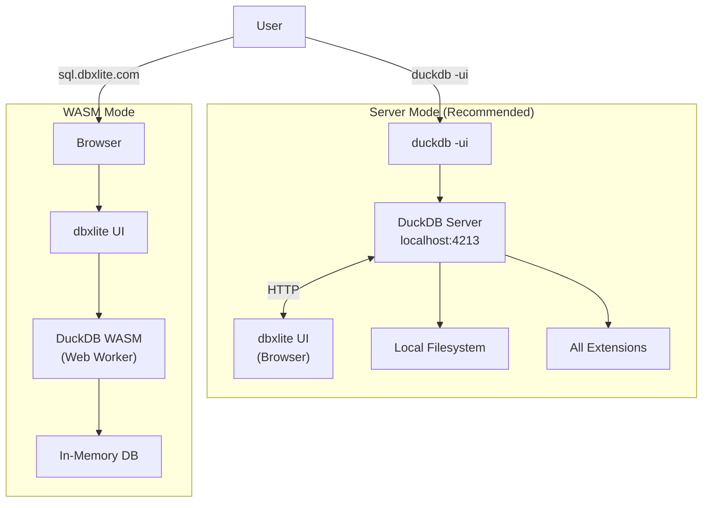

### Mode Comparison

| Capability | Server Mode | WASM Mode |
|------------|-------------|-----------|
| **Memory** | Unlimited (system RAM) | ~2-4GB browser limit |
| **Extensions** | All (httpfs, spatial, iceberg, etc.) | Limited subset |
| **Filesystem** | Direct access | File handles only |
| **Performance** | Native speed | Near-native (WASM overhead) |
| **BigQuery** | Via DuckDB extension | Browser OAuth connector |
| **Offline** | Requires DuckDB CLI | Works after first load |
| **Install** | DuckDB CLI required | Zero install |

### How to Use Server Mode

```bash
# Start local asset server
npx dbxlite-ui                              # Serves UI on port 8080

# In another terminal, launch DuckDB with the local UI
export ui_remote_url="http://localhost:8080"
duckdb -unsigned -ui

# With an existing database
duckdb mydata.duckdb -unsigned -ui

# Alternative: Use hosted assets (no npm required)
export ui_remote_url="https://sql.dbxlite.com"
duckdb -unsigned -ui
```

Open http://localhost:4213 in your browser. The `-unsigned` flag is required for custom UI URLs.

> **Note:** The hosted URL only serves static UI assets (similar to the default DuckDB UI hosted by MotherDuck). All data and query execution stays local: DuckDB on your machine talks directly to your browser via localhost:4213. Nothing is sent to external servers.

---

## HTTP Mode Architecture

When running in Server mode, dbxlite communicates with a local DuckDB instance via HTTP:

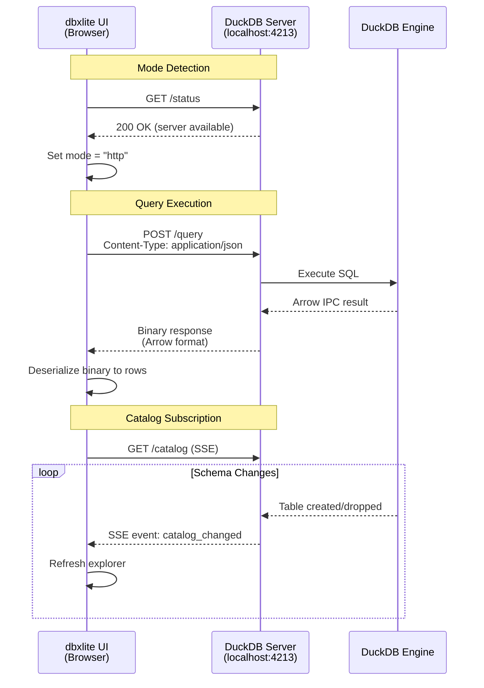

### HTTP Connector Components

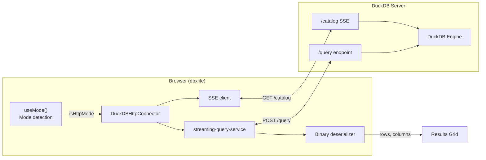

### Key Implementation Files

| File | Purpose |
|------|---------|
| `src/hooks/useMode.ts` | Mode detection (checks /status endpoint) |
| `src/hooks/useServerDatabases.ts` | Discovers databases/schemas via duckdb_databases() |
| `src/services/streaming-query-service.ts` | HTTP query execution with binary deserialization |
| `packages/connectors/src/duckdb-http-connector.ts` | HTTP connector implementation |

### Binary Protocol

DuckDB's HTTP server returns query results in Arrow IPC format for efficiency:

```
Request:  POST /query { "query": "SELECT * FROM users" }
Response: Binary (Arrow IPC)
          - Schema: column names + types
          - Record batches: row data
```

The `streaming-query-service.ts` deserializes this binary format into JavaScript objects:

```typescript
interface QueryResult {
  rows: TableRow[];      // Deserialized data
  columns: string[];     // Column names
  totalRows: number;     // Row count
  executionTime: number; // Query duration (ms)
}
```

### SSE Catalog Notifications

The `/catalog` endpoint uses Server-Sent Events to push schema changes:

```
GET /catalog
Connection: keep-alive

event: catalog_changed
data: {"type": "table_created", "name": "users"}

event: catalog_changed
data: {"type": "table_dropped", "name": "temp_data"}
```

This enables real-time explorer updates when tables are created/dropped via SQL.

---

## Local Storage Architecture

dbxlite uses multiple storage mechanisms to handle different file types and user preferences:

### Storage Overview

| Storage Type | Persists? | Location | Purpose |
|--------------|-----------|----------|---------|
| **File handles** | Yes | IndexedDB: `dbxlite-file-handles` | References to local files via File System Access API - enables zero-copy access without re-upload |
| **User settings** | Yes | localStorage: `dbxlite-settings` | Theme, formatting, editor preferences (Zustand persist middleware) |
| **DuckDB database** | No | Browser RAM (`:memory:`) | Query execution engine - tables lost on refresh |
| **Uploaded file buffers** | No | DuckDB virtual FS | Files copied to memory during session - lost on refresh |
| **Remote file URLs** | Yes* | localStorage: `dbxlite-settings` | File URLs only, files accessed via httpfs extension |

*URL references persist; actual files fetched on-demand

### Browser Storage Diagram

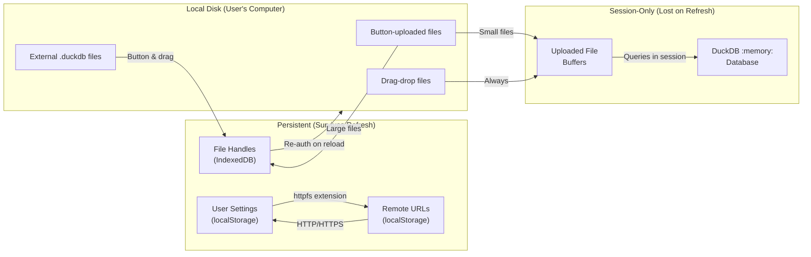

### File Handling Patterns

DuckDB handles files in five distinct ways depending on upload method and file type:

#### 1. Persistent File References (Button Upload - Large Files)
- **How it works**: File System Access API creates a persistent reference stored in IndexedDB
- **Storage location**: File handle in IndexedDB (`dbxlite-file-handles`)
- **Query method**: DuckDB accesses file directly via file handle (zero-copy)
- **Across sessions**: File handle restored from IndexedDB on reload; browser requests permission re-auth
- **Re-upload needed**: No - file reference persists
- **Use case**: Large CSV/Parquet files, external data sources

**Implementation**: `file-handle-store.ts` - `storeHandle(id, name, handle)`

#### 2. Session-Only Buffers (Button Upload - Small Files)
- **How it works**: File copied into DuckDB's virtual filesystem during session
- **Storage location**: DuckDB virtual FS (in RAM)
- **Query method**: Tables created or imported into DuckDB
- **Across sessions**: Lost on page refresh
- **Re-upload needed**: Yes - entire file must be re-uploaded
- **Use case**: Small test files, temporary data imports

#### 3. Volatile Drag-Drop Files
- **How it works**: Files dragged directly into app are always buffered (no file handle creation)
- **Storage location**: DuckDB virtual FS (in RAM), marked `volatile: true`
- **Query method**: Tables created immediately without disk access
- **Across sessions**: Lost on page refresh
- **Re-upload needed**: Yes - always requires re-upload
- **Use case**: Quick exploratory analysis, temporary datasets

#### 4. Attached External Databases
- **How it works**: External .duckdb files attached via `ATTACH DATABASE` SQL command
- **Storage location**: File handle (persistent) or RAM buffer (volatile)
- **Button upload**: Uses file handle, persistent reference
- **Drag-drop**: Always volatile, lost on refresh
- **Query method**: `ATTACH DATABASE <filename> AS db_alias`
- **Use case**: Working with multiple DuckDB databases, data federation

#### 5. Remote Files (HTTP/HTTPS URLs)
- **How it works**: httpfs extension loads data directly from remote URLs without upload
- **Storage location**: URL string in localStorage (no data stored locally)
- **Query method**: DuckDB queries URL directly: `SELECT * FROM 'https://example.com/data.csv'`
- **Across sessions**: URL reference persists (file stays on remote server)
- **Network**: Files fetched on-demand when queries execute
- **Use case**: Cloud data sources, public datasets, shared file links

**Implementation**: `dataSourceStore/store.ts` - `addRemoteURL(url)` - httpfs extension auto-loads on first use

### DuckDB In-Memory Configuration

DuckDB runs in-memory (`:memory:` path) for reliability:

```javascript
// worker.ts
await db.open({
  path: ':memory:',
  accessMode: duckdb.DuckDBAccessMode.READ_WRITE
});
```

**Why no OPFS (file-system persistence)?**
- Issue #1576: DuckDB WASM temp_directory filesystem problems
- Issue #2096: COI worker OPFS causes crashes
- See: https://github.com/duckdb/duckdb-wasm/discussions/1322

**Implications**:
- All `CREATE TABLE` results are session-only
- Large analytical results should be exported before closing
- File-based queries re-execute from persisted file handles on reload

### Browser Requirements

| Browser | Minimum Version | Notes |
|---------|-----------------|-------|
| Chrome/Edge | 86+ | Full support |
| Firefox | 113+ | Partial File System Access API support |
| Safari | 15.2+ | No `showOpenFilePicker` - uses fallback |

> Requires HTTPS or localhost for File System Access API
> DuckDB WASM auto-selects optimal build variant at runtime

---

## System Architecture

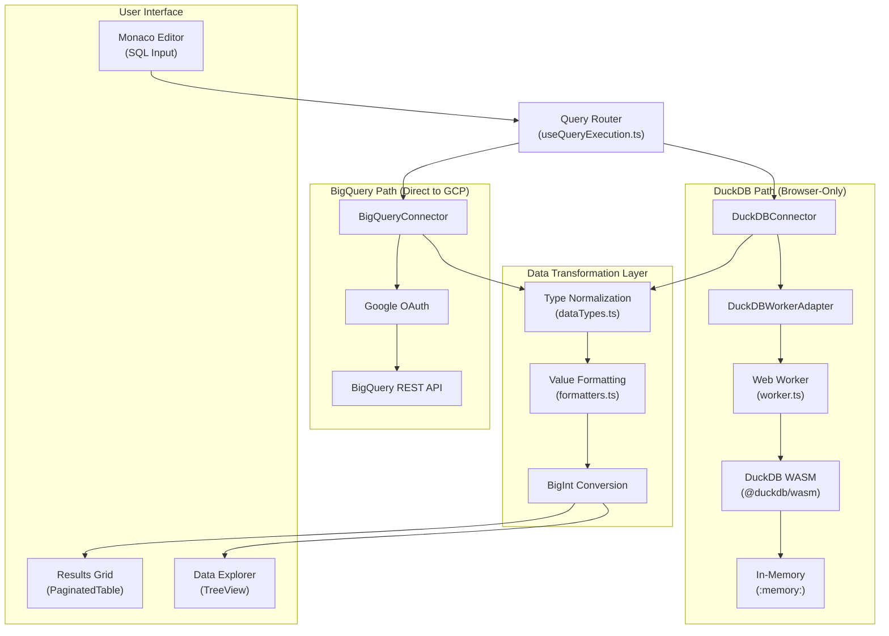

---

## DuckDB + WebAssembly

### What is WebAssembly (WASM)?

WebAssembly is a binary instruction format enabling near-native performance in browsers:

| Aspect | Traditional JS | WebAssembly |
|--------|---------------|-------------|
| Format | Text (parsed) | Binary (decoded) |
| Speed | JIT compilation | Pre-compiled |
| Performance | Variable (GC pauses) | Predictable |

**DuckDB WASM Specifics:**
- Full DuckDB database engine compiled to WASM
- ~105MB binary with all features
- Runs entirely in browser (no server)
- Uses browser's memory model

### WASM Bundle Selection

dbxlite uses the **EH (Exception Handling)** bundle for maximum compatibility:

| Bundle | Pros | Cons |
|--------|------|------|
| **EH** (Selected) | Works everywhere, no special headers | Single-threaded |
| MVP | Smallest size | Limited features |
| COI | Multi-threaded, fastest | Requires COOP/COEP headers |

```javascript
// Bundle selection in worker.ts
const bundle = selectedBundles.eh || await duckdb.selectBundle(selectedBundles);
```

---

## Worker Architecture

### Message Protocol

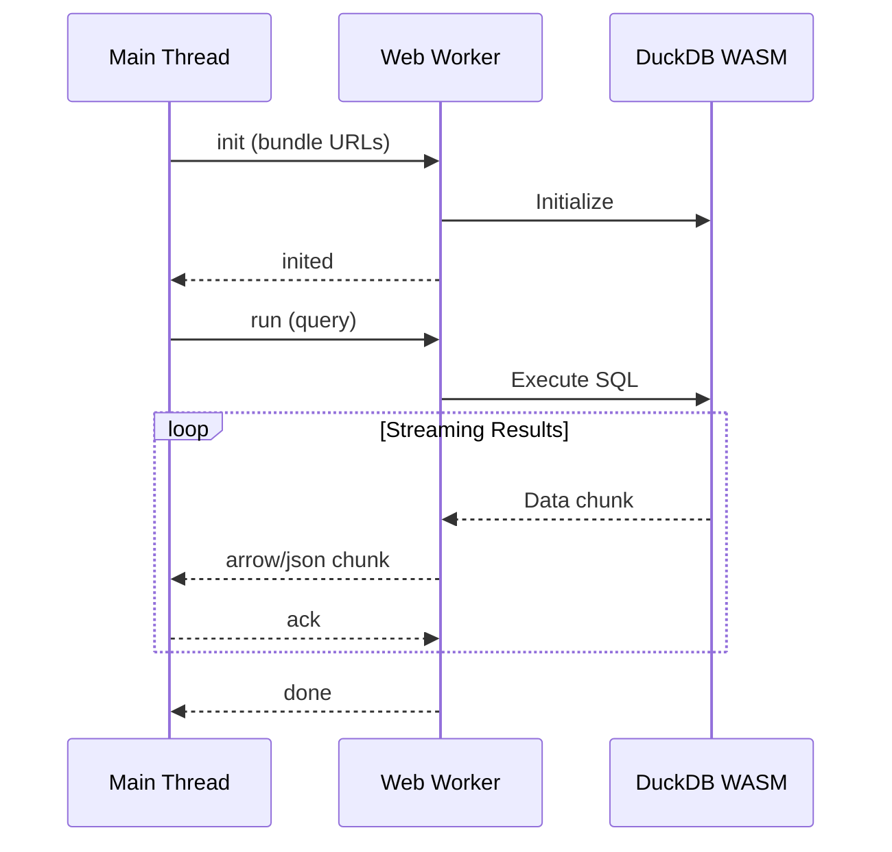

**Worker → Main Thread Messages:**
| Type | Payload | Purpose |
|------|---------|---------|
| `inited` | Worker version | Worker initialized and ready |
| `error` | Error details | Error occurred during operation |
| `json-schema` | Column metadata | Result schema information |
| `json` | Data rows | JSON format result chunk |
| `arrow` | Arrow IPC buffer | Arrow IPC format result chunk |
| `file_registered` | File info | File registration completed |
| `file_buffer` | Buffer metadata | File buffer copy completed |
| `cancelled` | Query ID | Query cancellation confirmed |
| `query-stats` | Execution stats | Query statistics (rows, execution time) |
| `done` | Query ID | Query execution complete |

**Main Thread → Worker Messages:**
| Type | Payload | Purpose |
|------|---------|---------|
| `init` | Bundle URLs | Initialize with DuckDB WASM bundle paths |
| `run` | SQL + options | Execute query with streaming options |
| `register_file` | File data | Register uploaded file buffer |
| `copy_file_to_buffer` | File handle | Copy file to DuckDB virtual filesystem |
| `register_file_handle` | File handle | Register File System Access API handle |
| `cancel` | Query ID | Cancel running query |
| `ack` | Chunk ID | Acknowledge chunk receipt (backpressure control) |

---

## Memory Management

### Configuration

| Setting | Value | Purpose |
|---------|-------|---------|
| `memory_limit` | -1 | Unlimited (browser limits) |
| `threads` | 1 | Reduce fragmentation |
| `MAX_OUTSTANDING` | 2 | Backpressure limit |
| `MAX_CHUNK_BYTES` | 5MB | JSON chunk size |
| `GC_INTERVAL` | 15s | Periodic cleanup |

### Grid Caching Strategy

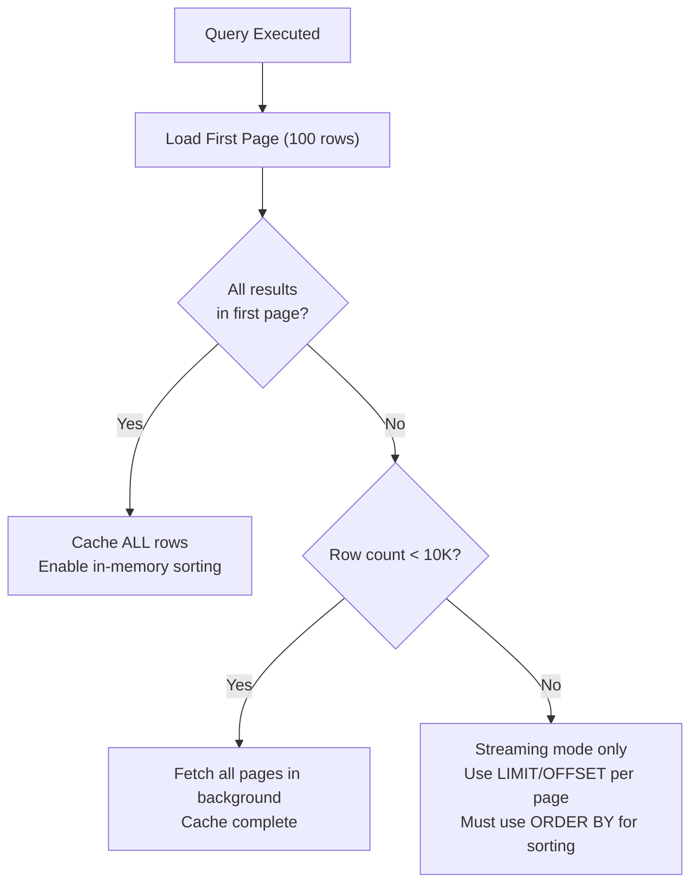

---

## BigQuery Integration

### OAuth Flow (No Proxy Required)

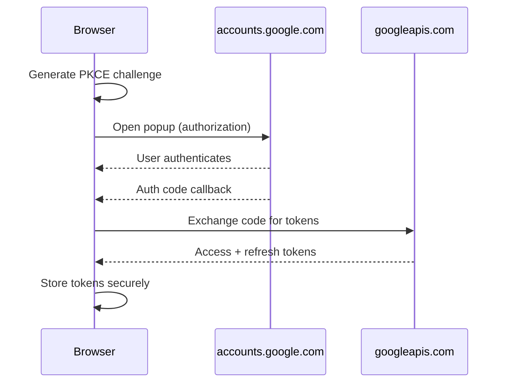

**Google APIs support CORS natively** - no proxy needed.

### API Endpoints

| Endpoint | Method | Purpose |
|----------|--------|---------|
| `/o/oauth2/v2/auth` | GET | Authorization |
| `oauth2.googleapis.com/token` | POST | Token exchange |
| `cloudresourcemanager.googleapis.com/v1/projects` | GET | List projects |
| `bigquery.googleapis.com/.../datasets` | GET | List datasets |
| `bigquery.googleapis.com/.../queries` | POST | Execute query |

---

## Data Type Normalization

Types from different sources are normalized to a unified schema for consistent display and querying:

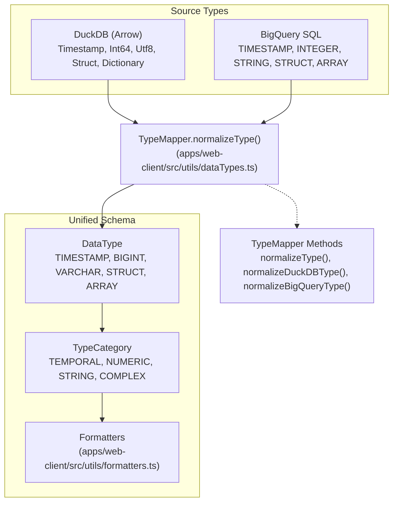

**Type System Implementation:**
- **DuckDB types**: Mapped from Arrow IPC schema in worker results
- **BigQuery types**: Mapped from BigQuery API responses
- **Unified schema**: Consistent types across all connectors
- **Formatting**: Display layer converts unified types to human-readable strings

---

## Future: Snowflake Integration

> **Status: Planned for future release**

Snowflake integration will require a CORS proxy due to Snowflake's API restrictions:

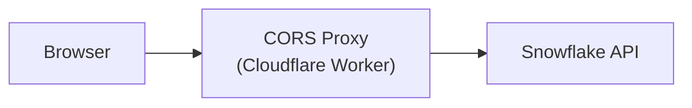

- Vite dev plugin for local development
- Cloudflare Worker for production
- OAuth flow via proxy
- SQL REST API access

---

## React Application Architecture

### Component Hierarchy

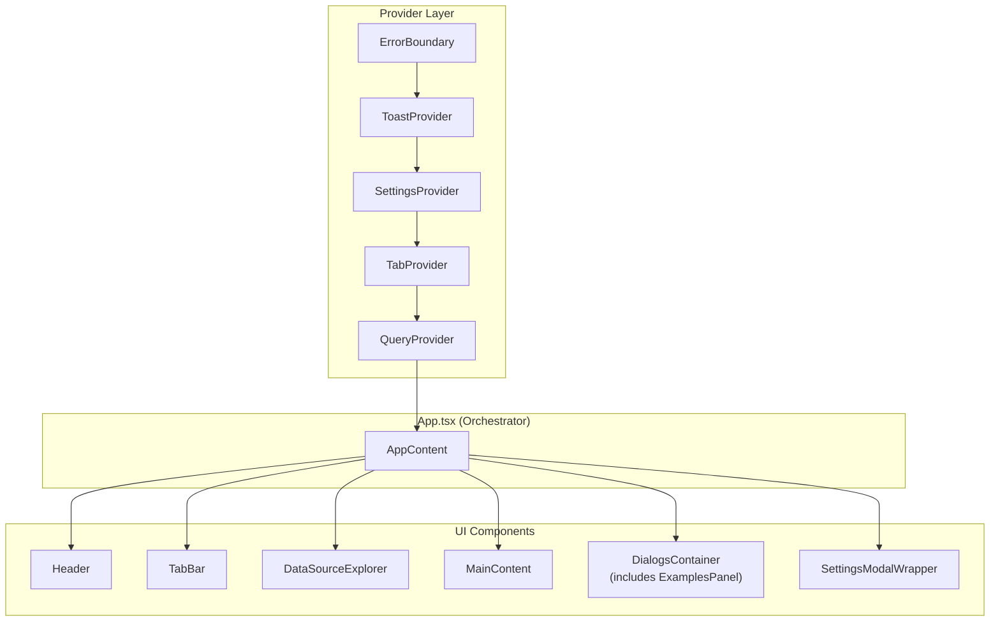

### State Management

| Context/Store | Purpose | Location |
|--------------|---------|----------|
| **ErrorBoundary** | Global error handling | `src/App.tsx` |
| **TabContext** | Tab state, editor/grid refs | `src/contexts/TabContext.tsx` |
| **QueryContext** | Active connector, BigQuery status | `src/contexts/QueryContext.tsx` |
| **SettingsProvider** | Settings store wrapper (deprecated) | `src/services/settings-store.tsx` |
| **settingsStore** | Zustand store for UI settings | `src/stores/settingsStore.ts` |
| **DataSourceStore** | Loaded files, databases (Zustand) | `src/stores/dataSourceStore/store.ts` |
| **ToastProvider** | Notifications | `src/components/Toast.tsx` |

**Note**: SettingsProvider is a compatibility wrapper. The actual settings implementation is the Zustand store in `settingsStore.ts` which uses localStorage for persistence.

### Custom Hooks

| Hook | Purpose |
|------|---------|
| `useTabManager` | Tab CRUD operations and persistence |
| `useConnector` | Connector switching and BigQuery authentication |
| `useQueryExecution` | Query execution, streaming, and cancellation |
| `useFileOperations` | File open, save, and SQL insert operations |
| `useFileConflict` | File conflict resolution dialog handling |
| `useFileReload` | Restore file handles from IndexedDB on app load |
| `useAutoSave` | 3-second debounced auto-save functionality |
| `useKeyboardShortcuts` | Global keyboard bindings and shortcuts |
| `useEditorLayout` | Resizable editor pane state management |
| `useQueryOverlay` | Long-running query indicator with elapsed time |
| `useUIVisibility` | Explorer and settings panel visibility toggles |

### Container Components

| Component | Contains | Purpose |
|-----------|----------|---------|
| `DialogsContainer` | ToastHistory, ConfirmDialog, FileConflictDialog | Groups modal dialogs |
| `MainContent` | EditorPane, ResultPane, ResizeSplitter | Main editor/results area |
| `ResizableExplorer` | DataSourceExplorer | Collapsible sidebar |

### Data Flow

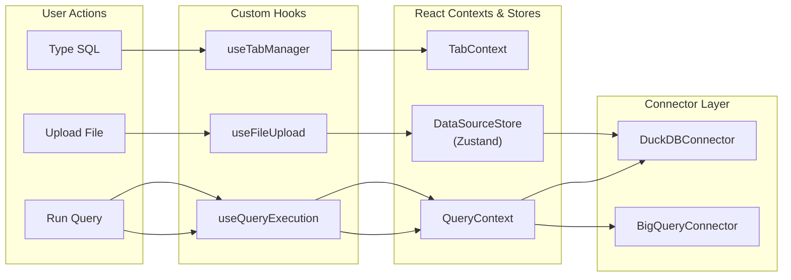

---

## Code References

### Core Packages

| Package | File | Purpose |
|---------|------|---------|
| `packages/connectors/src/` | `duckdb-connector.ts` | DuckDB query execution |
| `packages/connectors/src/` | `bigquery-connector.ts` | BigQuery OAuth & queries |
| `packages/connectors/src/` | `streaming-duckdb-connector.ts` | Streaming result handling for DuckDB |
| `packages/duckdb-wasm-adapter/src/` | `worker.ts` | Web Worker implementation |
| `packages/duckdb-wasm-adapter/src/` | `index.ts` | Worker adapter interface |

### Data Types and Formatting

| Location | File | Purpose |
|----------|------|---------|
| `apps/web-client/src/utils/` | `dataTypes.ts` | Type normalization (DuckDB ↔ BigQuery ↔ unified schema) |
| `apps/web-client/src/utils/` | `formatters.ts` | Value formatting for display (temporal, numeric, complex types) |

### React Application Files

| Directory | File | Purpose |
|-----------|------|---------|
| `apps/web-client/src/contexts/` | `TabContext.tsx` | Tab state + editor/grid refs |
| `apps/web-client/src/contexts/` | `QueryContext.tsx` | Active connector and BigQuery auth state |
| `apps/web-client/src/hooks/` | `useTabManager.ts` | Tab CRUD operations and persistence |
| `apps/web-client/src/hooks/` | `useQueryExecution.ts` | Query lifecycle (execute, stream, cancel) |
| `apps/web-client/src/hooks/` | `useConnector.ts` | Connector switching and authentication |
| `apps/web-client/src/hooks/` | `useFileOperations.ts` | File open, save, insert SQL operations |
| `apps/web-client/src/hooks/` | `useFileConflict.ts` | File conflict resolution dialogs |
| `apps/web-client/src/hooks/` | `useFileReload.ts` | Restore file handles from IndexedDB |
| `apps/web-client/src/hooks/` | `useAutoSave.ts` | Debounced auto-save functionality |
| `apps/web-client/src/hooks/` | `useKeyboardShortcuts.ts` | Global keyboard binding handler |
| `apps/web-client/src/hooks/` | `useEditorLayout.ts` | Resizable editor pane state |
| `apps/web-client/src/hooks/` | `useQueryOverlay.ts` | Long-running query indicator |
| `apps/web-client/src/hooks/` | `useUIVisibility.ts` | Explorer/settings visibility toggles |
| `apps/web-client/src/containers/` | `DialogsContainer.tsx` | Groups modal dialogs and overlays |
| `apps/web-client/src/components/` | `ExamplesPanel.tsx` | Sample queries UI (inside DialogsContainer) |
| `apps/web-client/src/services/` | `file-handle-store.ts` | File handle persistence via IndexedDB |
| `apps/web-client/src/stores/` | `dataSourceStore/store.ts` | Data source state management (Zustand) |
| `apps/web-client/src/stores/` | `settingsStore.ts` | UI settings persistence (Zustand + localStorage) |

---

*Last updated: December 2025*
