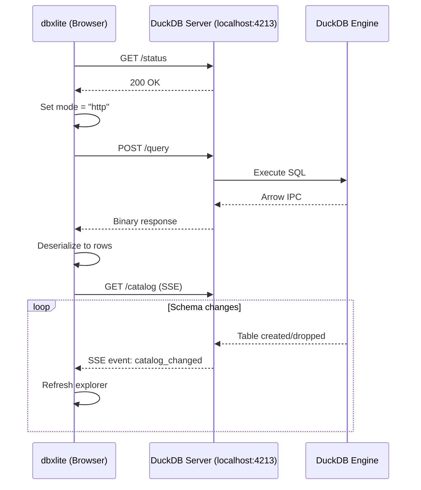
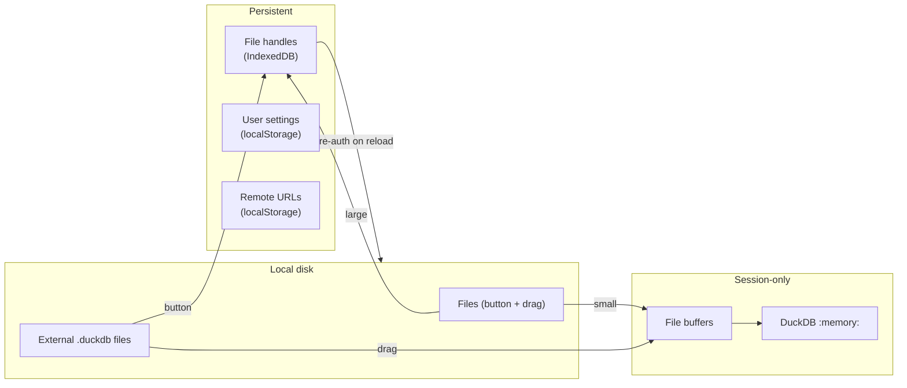
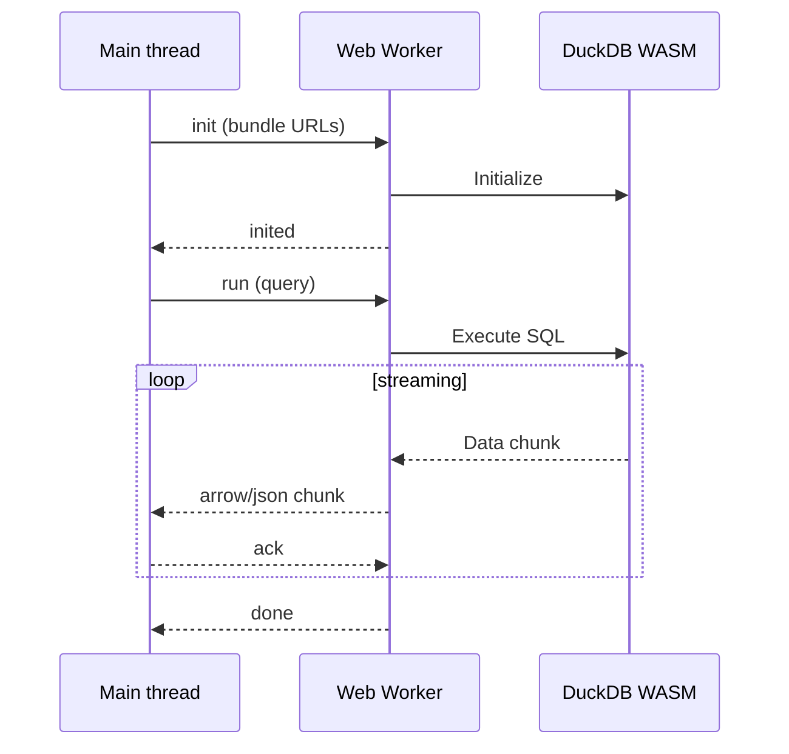
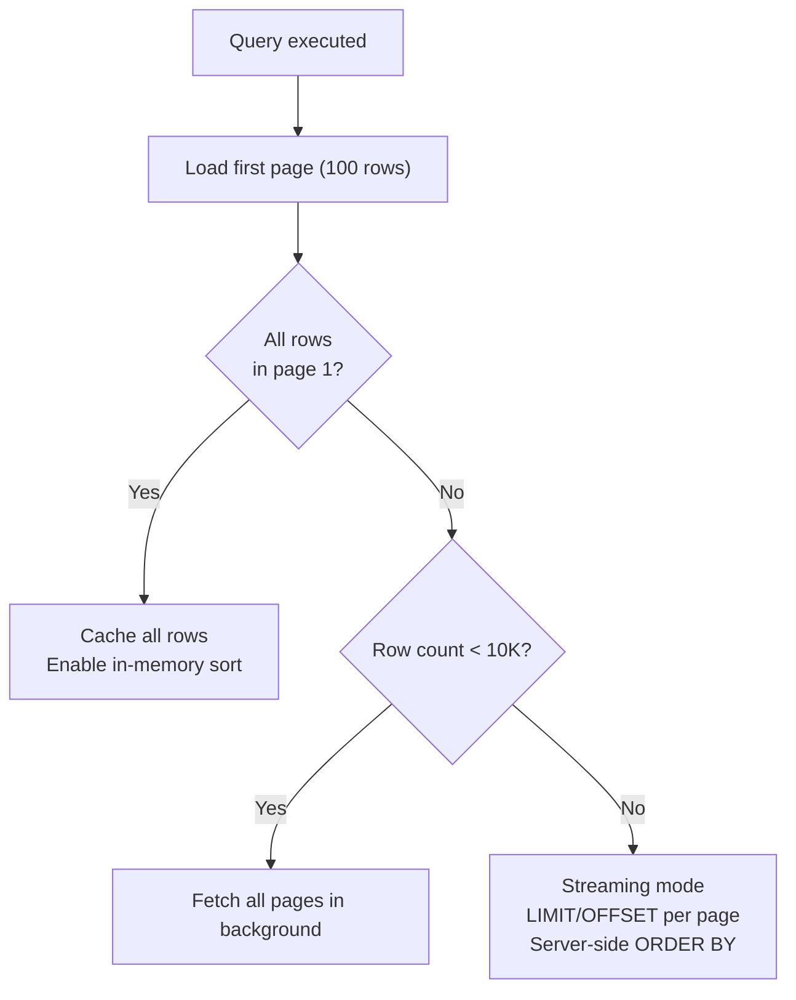
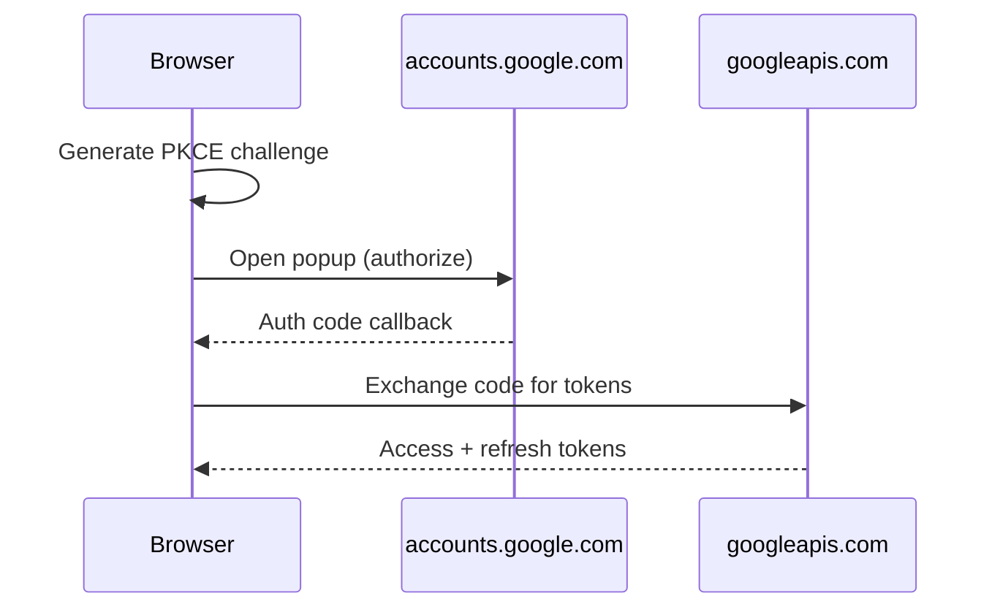
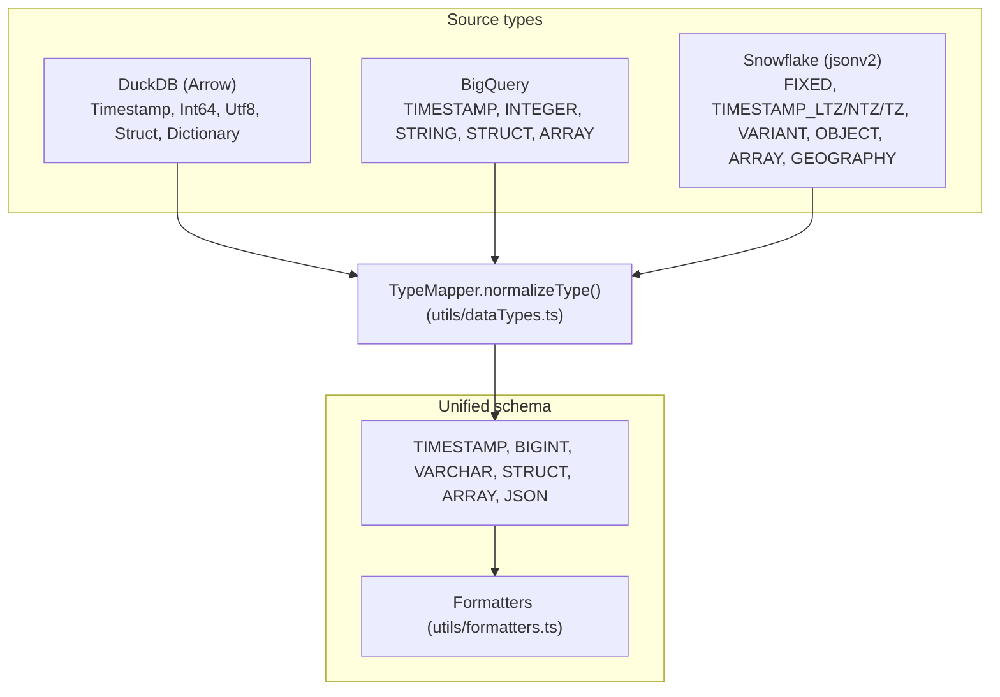
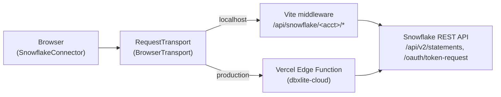
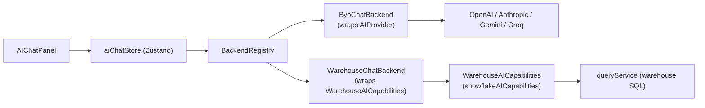
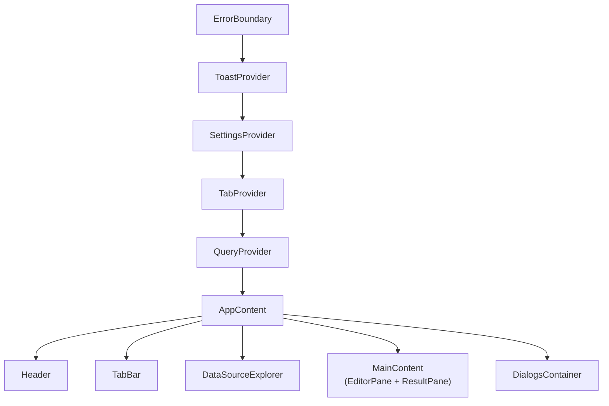

# Architecture

dbxlite runs DuckDB either in your browser (WebAssembly in a Web Worker) or against a local DuckDB CLI process over HTTP, with the same UI on top. Mode is auto-detected by probing `/status` on localhost. BigQuery and Snowflake are supported as cloud connectors that talk to their REST APIs from the browser; BigQuery directly because Google APIs serve CORS, Snowflake through a thin proxy because it doesn't.

This doc covers how the pieces fit, the wire formats, and the parts that took non-obvious work to get right. For Quick Start and the user-facing mode comparison, see the [README](../README.md).

---

## HTTP mode (Server)

In Server mode dbxlite talks to a local DuckDB instance over HTTP. DuckDB CLI launches a tiny HTTP server (`duckdb -unsigned -ui`) that serves Arrow IPC results and an SSE catalog stream.

```mermaid
sequenceDiagram
    participant UI as dbxlite (Browser)
    participant Server as DuckDB Server (localhost:4213)
    participant DB as DuckDB Engine

    UI->>Server: GET /status
    Server-->>UI: 200 OK
    UI->>UI: Set mode = "http"

    UI->>Server: POST /query
    Server->>DB: Execute SQL
    DB-->>Server: Arrow IPC
    Server-->>UI: Binary response
    UI->>UI: Deserialize to rows

    UI->>Server: GET /catalog (SSE)
    loop Schema changes
        DB-->>Server: Table created/dropped
        Server-->>UI: SSE event: catalog_changed
        UI->>UI: Refresh explorer
    end
```

Key files:

| File | Purpose |
|------|---------|
| `apps/web-client/src/hooks/useMode.ts` | Mode detection via `/status` probe |
| `apps/web-client/src/hooks/useServerDatabases.ts` | Discovers databases/schemas via `duckdb_databases()` |
| `packages/connectors/src/duckdb-http-connector.ts` | HTTP connector implementation |

Binary protocol: requests are JSON (`POST /query`); responses are raw Arrow IPC (schema + record batches). The connector deserializes into a `QueryResult` shape with `rows`, `columns`, `totalRows`, `executionTime`.

The SSE `/catalog` endpoint pushes `table_created` / `table_dropped` events so the explorer refreshes without polling.

---

## Local storage

dbxlite uses browser storage to balance persistence and isolation:

| Storage | Persists? | Location | Purpose |
|---------|-----------|----------|---------|
| File handles | Yes | IndexedDB `dbxlite-file-handles` | File System Access API references; zero-copy access without re-upload |
| User settings | Yes | localStorage `dbxlite-settings` | Theme, formatter prefs (Zustand persist) |
| Remote URLs | Yes | localStorage `dbxlite-settings` | URL strings only; files fetched via httpfs on demand |
| DuckDB database | No | RAM (`:memory:`) | Tables lost on refresh |
| Uploaded buffers | No | DuckDB virtual FS | In-memory during session |

```mermaid
flowchart LR
    subgraph Persistent["Persistent"]
        Handles["File handles<br/>(IndexedDB)"]
        Settings["User settings<br/>(localStorage)"]
        URLs["Remote URLs<br/>(localStorage)"]
    end
    subgraph Session["Session-only"]
        RAM["DuckDB :memory:"]
        Buffers["File buffers"]
    end
    subgraph Disk["Local disk"]
        Files["Files (button + drag)"]
        DBs["External .duckdb files"]
    end
    Files -->|large| Handles
    Files -->|small| Buffers
    DBs -->|button| Handles
    DBs -->|drag| Buffers
    Buffers --> RAM
    Handles -->|re-auth on reload| Disk
```

### File handling

Files are handled five different ways depending on how they enter the app:

1. **Button-uploaded large files** — File System Access API creates a persistent handle (IndexedDB). Browser re-prompts permission on reload, but the file reference survives. Implementation: `file-handle-store.ts`.
2. **Button-uploaded small files** — Copied into DuckDB's virtual FS. Lost on refresh.
3. **Drag-drop** — Always volatile. Tables created from the buffer; no handle stored.
4. **Attached `.duckdb` files** — `ATTACH DATABASE` with either a persistent handle (button) or a volatile buffer (drag).
5. **Remote URLs** — URL string in localStorage; httpfs fetches on demand. The file never leaves the remote server.

### DuckDB in-memory

DuckDB runs `:memory:` in WASM mode. OPFS-backed persistence is blocked by [duckdb-wasm#1322](https://github.com/duckdb/duckdb-wasm/discussions/1322) and related issues. Implications: `CREATE TABLE` results are session-only; export anything you need to keep.

### Browser requirements

Chrome/Edge 86+, Firefox 113+, Safari 15.2+ (no `showOpenFilePicker`, falls back to `<input type="file">`). HTTPS or localhost required for File System Access API.

---

## DuckDB WASM bundle

The Web Worker loads the **EH (Exception Handling)** bundle for compatibility:

| Bundle | Tradeoff |
|--------|----------|
| **EH** (selected) | Works everywhere, single-threaded |
| MVP | Smallest, limited features |
| COI | Multi-threaded, requires COOP/COEP headers |

Selection happens at runtime in `worker.ts` via `selectedBundles.eh ?? duckdb.selectBundle(...)`.

---

## Worker architecture

DuckDB WASM runs in a Web Worker; the main thread streams chunks over `postMessage` with explicit ack-based backpressure.

```mermaid
sequenceDiagram
    participant Main as Main thread
    participant Worker as Web Worker
    participant DB as DuckDB WASM

    Main->>Worker: init (bundle URLs)
    Worker->>DB: Initialize
    Worker-->>Main: inited

    Main->>Worker: run (query)
    Worker->>DB: Execute SQL
    loop streaming
        DB-->>Worker: Data chunk
        Worker-->>Main: arrow/json chunk
        Main-->>Worker: ack
    end
    Worker-->>Main: done
```

Worker → main: `inited`, `error`, `json-schema`, `json`, `arrow`, `file_registered`, `file_buffer`, `cancelled`, `query-stats`, `done`.

Main → worker: `init`, `run`, `register_file`, `copy_file_to_buffer`, `register_file_handle`, `cancel`, `ack`.

`MAX_OUTSTANDING = 2` and `MAX_CHUNK_BYTES = 5MB` cap memory while the grid catches up.

---

## Memory and grid caching

| Setting | Value | Why |
|---------|-------|-----|
| `memory_limit` | -1 | Unlimited; browser caps |
| `threads` | 1 | Reduces fragmentation under WASM |
| `MAX_OUTSTANDING` | 2 | Backpressure |
| `MAX_CHUNK_BYTES` | 5MB | JSON chunk size |
| `GC_INTERVAL` | 15s | Periodic cleanup |

Result-set caching strategy in the grid:

```mermaid
flowchart TD
    Q["Query executed"] --> P1["Load first page (100 rows)"]
    P1 --> AllOnPage{"All rows<br/>in page 1?"}
    AllOnPage -->|Yes| CacheAll["Cache all rows<br/>Enable in-memory sort"]
    AllOnPage -->|No| Small{"Row count < 10K?"}
    Small -->|Yes| Bg["Fetch all pages in background"]
    Small -->|No| Stream["Streaming mode<br/>LIMIT/OFFSET per page<br/>Server-side ORDER BY"]
```

A streaming-mode snapshot cache (`apps/web-client/src/components/table/hooks/useTableData.ts`) keeps per-tab `(connector, tabId, sql)` entries with LRU+TTL eviction, so switching back to a tab restores results without re-running the warehouse query.

---

## BigQuery integration

Google APIs support CORS, so no proxy is needed. The connector talks directly to GCP from the browser.

```mermaid
sequenceDiagram
    participant Browser
    participant Google as accounts.google.com
    participant API as googleapis.com

    Browser->>Browser: Generate PKCE challenge
    Browser->>Google: Open popup (authorize)
    Google-->>Browser: Auth code callback
    Browser->>API: Exchange code for tokens
    API-->>Browser: Access + refresh tokens
```

| Endpoint | Purpose |
|----------|---------|
| `accounts.google.com/o/oauth2/v2/auth` | Authorization |
| `oauth2.googleapis.com/token` | Token exchange |
| `cloudresourcemanager.googleapis.com/v1/projects` | List projects |
| `bigquery.googleapis.com/.../datasets` | List datasets |
| `bigquery.googleapis.com/.../queries` | Execute query |

OAuth refresh-token races are coalesced via an in-flight `refreshPromise` lock; concurrent expired-access-token requests share a single token-exchange call.

---

## Data type normalization

Types from each source are normalized to a unified schema for consistent display and query semantics.

```mermaid
flowchart TB
    subgraph Sources["Source types"]
        DuckDB["DuckDB (Arrow)<br/>Timestamp, Int64, Utf8, Struct, Dictionary"]
        BQ["BigQuery<br/>TIMESTAMP, INTEGER, STRING, STRUCT, ARRAY"]
        SF["Snowflake (jsonv2)<br/>FIXED, TIMESTAMP_LTZ/NTZ/TZ, VARIANT, OBJECT, ARRAY, GEOGRAPHY"]
    end
    Mapper["TypeMapper.normalizeType()<br/>(utils/dataTypes.ts)"]
    subgraph Unified["Unified schema"]
        DataType["TIMESTAMP, BIGINT, VARCHAR, STRUCT, ARRAY, JSON"]
        Fmt["Formatters (utils/formatters.ts)"]
    end
    DuckDB --> Mapper
    BQ --> Mapper
    SF --> Mapper
    Mapper --> DataType --> Fmt
```

Key normalization rules:

- DuckDB types come from the Arrow IPC schema in worker results.
- BigQuery types come from the API response.
- Snowflake types come from the `jsonv2` rowtype metadata: `FIXED` honors scale, `TIMESTAMP_*` parses epoch strings, `VARIANT/OBJECT/ARRAY` decode from JSON.

---

## Snowflake integration

Snowflake's `*.snowflakecomputing.com` endpoints don't return CORS headers, so requests route through a thin proxy. The proxy never sees credentials beyond the access or PAT bearer the user already holds. See [SNOWFLAKE.md](SNOWFLAKE.md) for the full design.

```mermaid
flowchart LR
    Browser["Browser<br/>(SnowflakeConnector)"] --> Transport["RequestTransport<br/>(BrowserTransport)"]
    Transport -->|localhost| Vite["Vite middleware<br/>/api/snowflake/&lt;acct&gt;/*"]
    Transport -->|production| Edge["Vercel Edge Function<br/>(dbxlite-cloud)"]
    Vite --> SF["Snowflake REST API<br/>/api/v2/statements, /oauth/token-request"]
    Edge --> SF
```

Components:

- `packages/connectors/src/snowflake-connector.ts` — `SnowflakeConnector implements CloudConnector`. OAuth 2.0 PKCE + state CSRF, retry with exponential backoff on 408/429/503, partition iteration, `parseSnowflakeValue` (FIXED scale, all three TIMESTAMP variants).
- `packages/connectors/src/transport.ts` — `BrowserTransport` rewrites `*.snowflakecomputing.com` to `/api/snowflake/<acct>/*` on localhost.
- `apps/web-client/vite.config.ts` — `snowflakeProxyPlugin` (the built-in proxy can't take a per-request dynamic target).
- `apps/web-client/src/providers/catalog/SnowflakeCatalogProvider.ts` — implements `CatalogProvider` (compute lifecycle, session-context switching, query history, query stats).
- `dbxlite-cloud/api/snowflake/[...path].ts` — production Vercel Edge Function. Validates account regex, sanitizes request and response headers, injects `Cross-Origin-Resource-Policy: cross-origin`.

OAuth callback uses three independent channels (BroadcastChannel, postMessage, localStorage poll) with a 5-minute hard timeout. `popup.closed` is deliberately not polled because Cross-Origin-Opener-Policy `same-origin` makes it report `true` while the consent screen is still live.

Two auth modes are supported:

- **OAuth** — popup + PKCE against a Snowflake Security Integration. Requires ACCOUNTADMIN to create the integration.
- **PAT** — Programmatic Access Token (Snowsight → My Profile → Programmatic Access Tokens). No admin needed; token is sent as `Authorization: Bearer <pat>` plus `X-Snowflake-Authorization-Token-Type: PROGRAMMATIC_ACCESS_TOKEN`. Bound to a single role at creation.

---

## Provider abstraction

The catalog explorer is generic across cloud warehouses. `CatalogProvider` (`apps/web-client/src/providers/catalog/types.ts`) is the interface; one `CatalogExplorer` component renders any implementation. Snowflake has the real provider today (`SnowflakeCatalogProvider.ts`); BigQuery still has a `.sketch.ts` file that validates the interface fits but the real BQ explorer is unmigrated, and DuckDB-attached databases haven't been adapted at all yet.

The interface covers vendor-neutral methods (`setComputeContext`, `getComputeStatus`, `resumeCompute`, `setDataContext`, `listAvailable*`, `getQueryHistory`, `getQueryStats`), capability flags like `requiresReconnectForRoleSwitch`, and a `catalogTerm` `{singular, plural}` so Snowflake can call them "databases" while BigQuery calls them "projects" without the UI caring.

---

## AI SQL assistant

The chat panel connects to either a BYO API key (OpenAI / Anthropic / Gemini / Groq) or a warehouse-native LLM (Snowflake Cortex). Two layers of indirection keep the UI vendor-agnostic.

```mermaid
graph LR
    UI["AIChatPanel"] --> Store["aiChatStore (Zustand)"]
    Store --> Registry["BackendRegistry"]
    Registry --> BYO["ByoChatBackend<br/>(wraps AIProvider)"]
    Registry --> WH["WarehouseChatBackend<br/>(wraps WarehouseAICapabilities)"]
    BYO --> Providers["OpenAI / Anthropic / Gemini / Groq"]
    WH --> Caps["WarehouseAICapabilities<br/>(snowflakeAICapabilities)"]
    Caps --> QS["queryService (warehouse SQL)"]
```

`ChatBackend` is the unified UI-facing interface. Each backend declares `id`, `kind: "byo" | "warehouse"`, `label`, `models[]`, `isAvailable()`, `streamChat(messages, opts)`, optional `estimateCost()`. Switching providers is a backend-id swap.

The bridge for warehouse backends is `WarehouseChatBackend` (`services/ai/warehouse-backend.ts`), which accepts any `WarehouseAICapabilities` and never imports `streaming-query-service` directly. Execution goes through the capability's own `execute()` method. Only `services/ai/wire-warehouse-backends.ts` imports `streaming-query-service`.

### Streaming error contract

All backends honor a single contract, enforced by `services/ai/__tests__/chat-backend.contract.vitest.ts` (81 parameterized tests over 4 BYO backends + a mocked Cortex):

| Phase | Behavior | Codes |
|---|---|---|
| Pre-handshake | Throws synchronously, zero chunks yielded | `MISSING_API_KEY`, `INVALID_MODEL`, `PROMPT_TOO_LARGE`, `BACKEND_NOT_AVAILABLE` |
| In-stream | Yields one `{type:"error",...}` + one `{type:"done"}`. Never throws post-handshake. | `WAREHOUSE_TIMEOUT`, `WAREHOUSE_SUSPENDED`, `EXECUTE_FAILED`, `PARSE_FAILED`, `PERMISSION_DENIED`, `RATE_LIMITED`, `ABORTED` |

Boundary: "after `capabilities.execute()`" (warehouse) or "after `fetch` fires" (BYO).

### Snowflake Cortex

`providers/catalog/snowflake-ai-capabilities.ts` factories a `WarehouseAICapabilities` that emits `SELECT SNOWFLAKE.CORTEX.COMPLETE(model, PARSE_JSON('[{role,content}]'), PARSE_JSON('{}'))`. The chat-array form is required; flat role-prefixed strings caused the model to echo `"ASSISTANT:"` in early prototypes. Cortex models are curated against Snowflake's published list (a hosted-manifest auto-refresh path is on the backlog).

### PII consent

BYO backends transmit the user's editor SQL plus chat history to a third-party service. A one-time consent dialog (`components/PiiConsentDialog.tsx`) gates the first send to each BYO provider; warehouse backends skip it (data stays in the warehouse).

---

## Credential storage

All secrets (AI provider API keys, Snowflake/BigQuery OAuth tokens, OAuth client secrets when used, Snowflake PATs) are stored in `localStorage` encrypted with AES-GCM using a 256-bit device-bound key persisted in IndexedDB.

| Component | File |
|---|---|
| `EncryptedCredentialStore` | `packages/storage/src/index.ts` |
| AI key singleton | `services/ai/index.ts` (`aiCredentialStore`) |
| Connector singleton | constructed in `hooks/useAppInitialization.ts` |

The device key is generated on first use, stored at `dbxlite-keys/dbxlite-device-key`, and never leaves the browser. Encryption defends against casual `localStorage` reads and extensions without IndexedDB access. It does not protect against same-origin XSS. See [SECURITY.md](../SECURITY.md) for the full threat model.

For Snowflake OAuth, `OAUTH_CLIENT_TYPE = 'PUBLIC'` (PKCE-only, RFC 8252 §8.5) is preferred. There's no client secret to store. `'CONFIDENTIAL'` mode is supported for backward compatibility; the secret is encrypted at rest but a public client is still safer.

Legacy plaintext entries from before the wrapper existed pass through unchanged on read (decode failure returns the raw value), so existing sessions don't break on upgrade.

---

## React app shape

The web client is a single-page React app built with Vite. Provider-context-hook layering, Zustand for state, Monaco for the editor.

```mermaid
flowchart TB
    Error["ErrorBoundary"] --> Toast["ToastProvider"]
    Toast --> Settings["SettingsProvider"]
    Settings --> Tab["TabProvider"]
    Tab --> Query["QueryProvider"]
    Query --> App["AppContent"]
    App --> Header
    App --> TabBar
    App --> Explorer["DataSourceExplorer"]
    App --> Main["MainContent<br/>(EditorPane + ResultPane)"]
    App --> Dialogs["DialogsContainer"]
```

State lives in three places by intent:

- **React contexts** for per-render-tree state with stable refs: `TabContext` (tab list + editor/grid refs), `QueryContext` (active connector, BigQuery auth status).
- **Zustand stores** for app-wide state with persistence: `settingsStore`, `dataSourceStore`, `aiChatStore`, `onboardingStore`.
- **`AbortController` refs** for query lifecycle: created in `useQueryExecution`, threaded through `connector.query(sql, { signal })` so cancel actually stops cloud-warehouse jobs server-side.

---

## Key files

| Surface | Files |
|---|---|
| Connector base + DuckDB | `packages/connectors/src/{base,duckdb-connector,duckdb-http-connector}.ts` |
| Cloud connectors | `packages/connectors/src/{bigquery-connector,snowflake-connector,transport}.ts` |
| DuckDB WASM bridge | `packages/duckdb-wasm-adapter/src/{worker,index}.ts` |
| Encrypted storage | `packages/storage/src/index.ts` |
| Query lifecycle | `apps/web-client/src/{services/streaming-query-service.ts,hooks/useQueryExecution.ts}` |
| Type normalization | `apps/web-client/src/utils/{dataTypes,formatters}.ts` |
| Catalog explorer | `apps/web-client/src/providers/catalog/` |
| AI bridge | `apps/web-client/src/services/ai/` |
